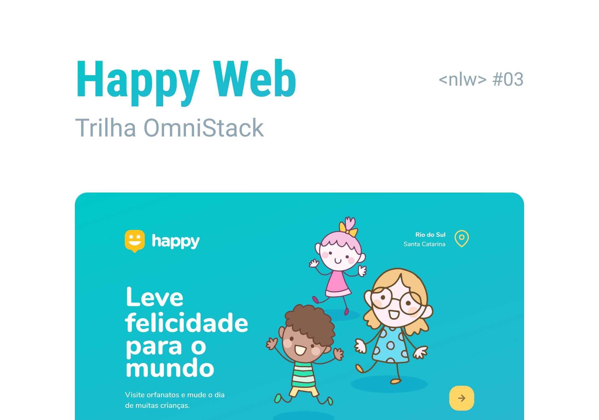

<h1 align="center">
    Happy
</h1>


<p align="center">
  
  
  
  
</p>

<br>

<p align="center">
  
</p>

## Tecnologias

Esse projeto foi desenvolvido com as seguintes tecnologias:

- [Node.js](https://nodejs.org/en/)
- [React](https://reactjs.org)
- [React Native](https://facebook.github.io/react-native/)
- [Expo](https://expo.io/)
- [TypeScript](https://www.typescriptlang.org/)

## O que é o Happy?

O Happy é uma aplicação que possibilita o cadastro de casas de acolhimento institucional atraves de um mapa, para que outras pessoas possam conhecer e fazer visitas

## Executando o Happy

### Server
```bash

$ cd server
$ yarn 
$ yarn dev

```

### Web
```bash

$ cd server
$ yarn 
$ yarn start

```


### Mobile
```bash

$ cd mobile
$ yarn 
$ yarn start

```

## Layout

Nos links abaixo você encontra o layout do projeto web e também do mobile. Lembrando que você precisa ter uma conta no [Figma](http://figma.com/) para acessá-lo.

- [Layout Web](https://www.figma.com/file/mDEbnoojksG4w8sOxmudh3/Happy-Web)
- [Layout Mobile](https://www.figma.com/file/X27FfVxAgy9f5IFa7ONlph/Happy-Mobile)
